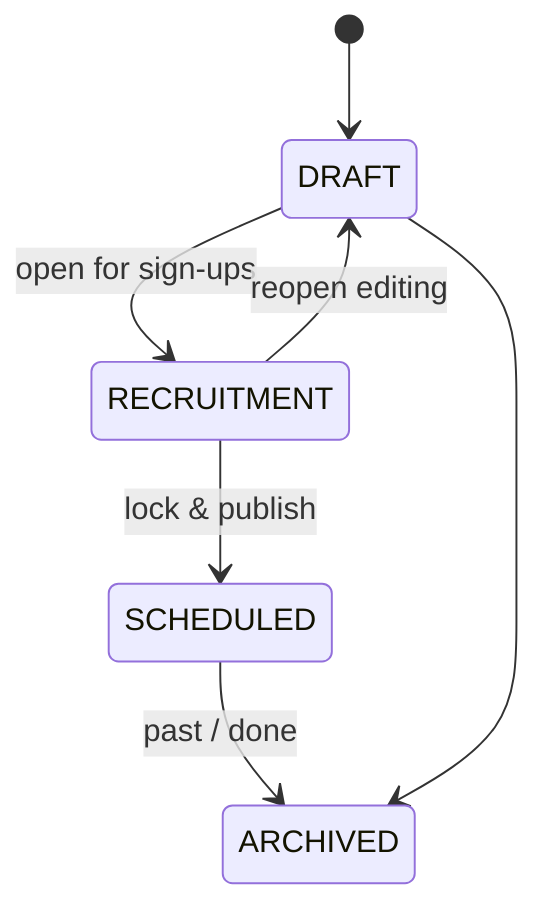
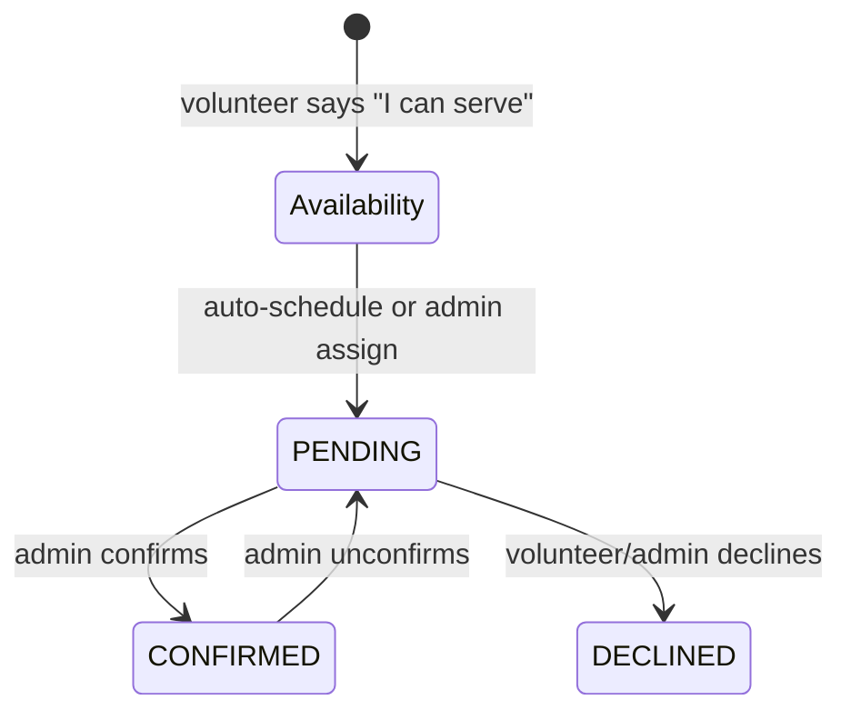
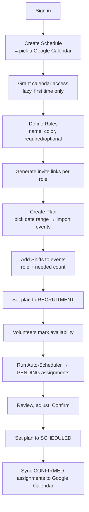
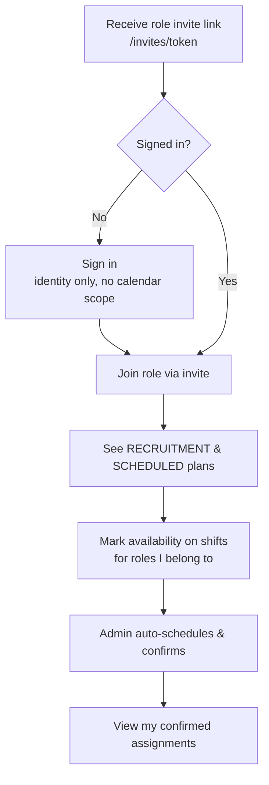
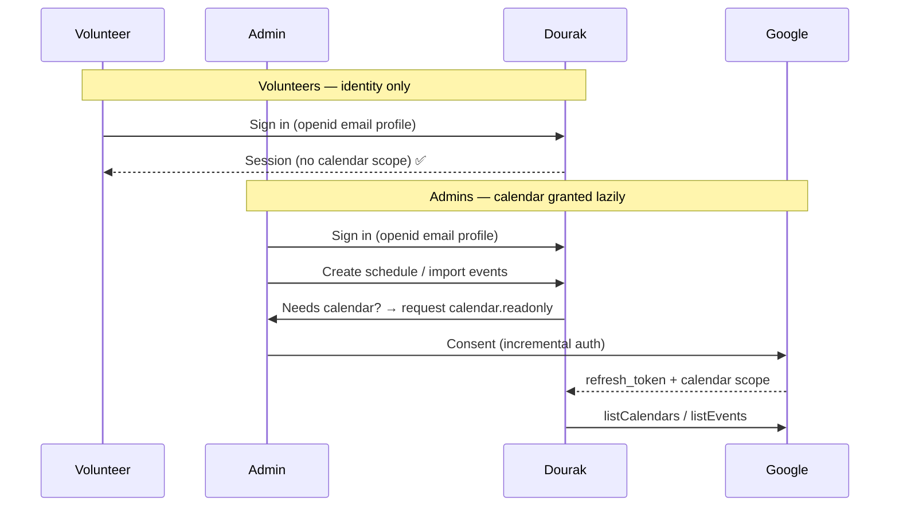

# Dourak — Product Documentation

> Volunteer scheduling built around Google Calendar. Admins import calendar
> events into recruitment plans, volunteers sign up for the roles they can
> serve, and an auto-scheduler proposes assignments that admins confirm and
> push back to Google Calendar.

---

## 1. Product Overview

Dourak turns a Google Calendar into a self-service volunteer scheduling system.

- A **Schedule** is bound to exactly one Google Calendar (e.g. "Sunday
  Service").
- Inside a schedule, admins create **Plans** — a date range of imported
  calendar events that go through a lifecycle from `DRAFT` to `ARCHIVED`.
- Each calendar event can have one or more **Shifts** (a slot for a specific
  **Role**, with a `needed` count).
- **Volunteers** join roles via invite links, mark their **Availability** for
  shifts, and get **Assignments** which sync to Google Calendar once confirmed.

### The two primary personas

| Persona            | Who they are                                           | Core job                                                                           |
| ------------------ | ------------------------------------------------------ | ---------------------------------------------------------------------------------- |
| **Schedule Admin** | Ministry / team lead. Owner or co-admin of a schedule. | Import events, define roles, recruit, auto-schedule, confirm, publish to calendar. |
| **Volunteer**      | Someone who serves in one or more roles.               | Join a role, say when they're available, view/confirm their assignments.           |

> **Onboarding principle:** Volunteers should **never** be asked for Google
> Calendar permissions. Calendar access is an _admin-only_ capability, requested
> lazily — only when an admin first needs to read or write calendar data.
> See [§7 Google Calendar Permission Model](#7-google-calendar-permission-model).

---

## 2. Core Concepts & Data Model

| Model            | Purpose                                                                                      | Key fields                                                   |
| ---------------- | -------------------------------------------------------------------------------------------- | ------------------------------------------------------------ |
| `User`           | Any authenticated person.                                                                    | `email` (unique), `name`, `image`                            |
| `Account`        | OAuth / email credentials (NextAuth). Holds Google `access_token`, `refresh_token`, `scope`. | `provider`, `scope`, `refresh_token`                         |
| `Schedule`       | Wrapper around one Google Calendar.                                                          | `name`, `googleCalendarId`, `userId` (owner)                 |
| `ScheduleAdmin`  | Co-admins of a schedule (besides owner).                                                     | `scheduleId` + `userId`                                      |
| `Plan`           | A date-range import of calendar events.                                                      | `name`, `startDate`, `endDate`, `status`                     |
| `CalendarEvent`  | An imported Google event within a plan.                                                      | `googleEventId`, `title`, `start`, `end`, `recurringEventId` |
| `Role`           | A servable position (e.g. Usher). Carries a public `inviteToken`.                            | `name`, `type`, `color`, `inviteToken`, `scheduleId`         |
| `UserRole`       | Membership of a user in a role.                                                              | `type` = `required` \| `optional`                            |
| `Shift`          | A slot for a role inside a calendar event.                                                   | `roleId`, `needed`, `name`                                   |
| `RecurringShift` | Template of shifts auto-applied to recurring event series.                                   | `roleId`, `needed`                                           |
| `Availability`   | A volunteer signalling interest in a shift.                                                  | `shiftId` + `userId`                                         |
| `Assignment`     | A volunteer placed into a shift.                                                             | `shiftId`, `userId`/`email`, `status`                        |

### Plan lifecycle



| Status        | Admin sees | Volunteer sees | Meaning                                 |
| ------------- | ---------- | -------------- | --------------------------------------- |
| `DRAFT`       | ✅ (edit)  | ❌             | Being built. Not visible to volunteers. |
| `RECRUITMENT` | ✅         | ✅             | Volunteers can mark availability.       |
| `SCHEDULED`   | ✅         | ✅             | Locked; assignments finalized.          |
| `ARCHIVED`    | ✅         | ❌             | Historical record.                      |

### Assignment status



Only `CONFIRMED` assignments are written back to Google Calendar.

### Role & membership types

- `Role.type` — `required` roles are prioritized by the auto-scheduler; `optional` roles are filled only if capacity remains.
- `UserRole.type` — per-person: `required` means the scheduler should place them; `optional` means place them only if needed.

---

## 3. Roles & Permissions

Admin authority is resolved by `isScheduleAdmin(scheduleId, userId)` in
[src/lib/permissions.ts](../src/lib/permissions.ts). A user is an admin if they
are the schedule **owner** (`Schedule.userId`) or listed in `ScheduleAdmin`.
Every admin-level server action guards on this check.

| Capability                                 | Admin | Volunteer |
| ------------------------------------------ | ----- | --------- |
| Create / delete schedules                  | ✅    | ❌        |
| Add / remove co-admins                     | ✅    | ❌        |
| Import events, create plans                | ✅    | ❌        |
| Change plan status                         | ✅    | ❌        |
| Create / edit roles, generate invite links | ✅    | ❌        |
| Run auto-scheduler                         | ✅    | ❌        |
| Confirm / unconfirm assignments            | ✅    | ❌        |
| Sync to/from Google Calendar               | ✅    | ❌        |
| Join a role via invite                     | ✅    | ✅        |
| Mark availability for own roles' shifts    | ✅    | ✅        |
| View own assignments                       | ✅    | ✅        |

---

## 4. Admin User Flow



### 4.1 Sign in

The admin authenticates at [src/app/login/page.tsx](../src/app/login/page.tsx)
via Google or email magic link. **Initial sign-in requests only basic identity
(`openid email profile`)** — no calendar scope. (See [§7](#7-google-calendar-permission-model).)

### 4.2 Create a schedule

`createScheduleAction(name, calendarId)` in
[src/app/actions/schedule.ts](../src/app/actions/schedule.ts). Because listing
calendars (`listCalendars`) needs Google access, **this is the first point a
calendar permission may be requested.** If the admin lacks the calendar scope,
they are routed through `reconnectGoogleCalendarAction` to grant it, then
returned to `/schedules/new`. The creating user becomes the owner.

### 4.3 Define roles & invite links

Via [src/components/role-manager.tsx](../src/components/role-manager.tsx) and
[src/app/actions/role.ts](../src/app/actions/role.ts):

- `createRoleAction` — name, `type`, `color`, `description`; auto-generates an `inviteToken`.
- `regenerateRoleInviteTokenAction` — rotate the public link.
- `addUserToRoleAction` / `removeUserFromRoleAction` — manually manage members and set `required`/`optional`.

Each role exposes a shareable link `/invites/{token}` (plus QR code) that
volunteers use to self-onboard.

### 4.4 Create a plan (import events)

`createPlanAction` fetches Google events in the chosen date range via
`listEvents`, then in a single transaction creates the `Plan`, its
`CalendarEvent`s, and auto-applies any `RecurringShift` templates. Permission
errors surface `ACCESS_TOKEN_SCOPE_INSUFFICIENT` and trigger a reconnect.

### 4.5 Build shifts & open recruitment

Admins attach shifts (role + `needed`) to events via
[src/components/event-card.tsx](../src/components/event-card.tsx), then move the
plan to `RECRUITMENT` with `updatePlanStatusAction` so volunteers can see it.

### 4.6 Auto-schedule

`autoScheduleAction(planId, scheduleId)` runs the scheduler
([src/lib/scheduler.ts](../src/lib/scheduler.ts)) over volunteers' availability
and role membership, creating `PENDING` assignments. See [§6](#6-the-auto-scheduler).

### 4.7 Confirm & publish

Admins review the matrix ([src/components/schedule-matrix.tsx](../src/components/schedule-matrix.tsx)),
manually assign (`adminAssignVolunteerAction`), confirm
(`confirmAssignmentAction`) or unconfirm, then set the plan to `SCHEDULED` and
push `CONFIRMED` assignments to Google Calendar via
[src/components/sync-schedule-button.tsx](../src/components/sync-schedule-button.tsx).

---

## 5. Volunteer User Flow

> **No calendar permissions are ever requested from a volunteer.** A volunteer
> only needs to prove identity (Google sign-in _without_ calendar scope, or an
> email magic link).



### 5.1 Accept an invite

The volunteer opens `/invites/{token}`
([src/app/invites/[token]/page.tsx](../src/app/invites/[token]/page.tsx)). If
unauthenticated they're sent to `/login?callbackUrl=/invites/{token}`. After
signing in, `joinRoleViaInviteAction(token)` creates a `UserRole` linking them
to the role. Already-members are redirected to the schedule.

### 5.2 Mark availability

On a `RECRUITMENT` plan the volunteer toggles availability per shift via
`toggleAvailabilityAction` (and bulk variants
`volunteerForMultipleEventsAction` / `cancelMultipleVolunteersAction`) in
[src/app/actions/assignment.ts](../src/app/actions/assignment.ts). The action
validates that the volunteer actually belongs to the shift's role.

### 5.3 View assignments

Once an admin confirms, the volunteer sees their assignments in the schedule
view ([src/components/schedule-view.tsx](../src/components/schedule-view.tsx)).
Confirmed assignments appear on the shared Google Calendar (published by the
admin), so volunteers get calendar reminders **without** granting Dourak any
calendar access themselves.

---

## 6. The Auto-Scheduler

[src/lib/scheduler.ts](../src/lib/scheduler.ts) — a constraint-satisfaction
solver with backtracking.

- **Inputs:** shifts (`roleId`, `start`, `end`, `needed`, existing assignments) and users (`roles` with `type`, `availableEvents`).
- **Divide & conquer:** problem is split per day; confirmed assignments become fixed "busy blocks".
- **Search:** events sorted most-constrained-first; recursion tries each eligible candidate, respecting role match, availability, and time-conflict constraints. Capped at 200,000 iterations.
- **Scoring** (`calculateScore`): prioritizes filling `required` roles, prefers `required`-type users, and balances workload across volunteers.
- **Output:** best-scoring set of `(shiftId, userId)` pairs, written as `PENDING` assignments.

---

## 7. Google Calendar Permission Model

**Goal:** ease volunteer onboarding by never requesting calendar access from
them. Calendar access is an admin-only, lazily-granted capability.

### Desired model



- **Read-only scope:** the app only ever needs
  `https://www.googleapis.com/auth/calendar.readonly`. There is no write-scope
  escalation.
- **Token handling:** `getValidAccessToken(userId)` in
  [src/lib/google.ts](../src/lib/google.ts) reads the stored token, refreshes it
  (5-minute expiry buffer) using the persisted `refresh_token`, and is used by
  `listCalendars` / `listEvents`.
- **Incremental authorization** (`include_granted_scopes: true`) lets the app
  add the calendar scope later without discarding identity consent.

### ⚠️ Current state vs. desired state

The desired lazy model is **not yet fully implemented**. Today the Google
provider in [src/auth.ts](../src/auth.ts) requests the calendar scope at _every_
sign-in:

```ts
scope: "openid email profile https://www.googleapis.com/auth/calendar.readonly",
prompt: "consent",
```

This means **volunteers who sign in with Google are asked for calendar
permission immediately** — the opposite of the onboarding goal.

**Recommended changes to defer calendar permission until an admin needs it:**

1. **Base sign-in = identity only.** Change the default Google provider scope in
   [src/auth.ts](../src/auth.ts) to `openid email profile` and drop the forced
   `prompt: "consent"` for the base flow. This covers all volunteers.
2. **Escalate on demand.** Keep the calendar scope inside the dedicated
   `connectGoogleCalendarAction` / `reconnectGoogleCalendarAction` server
   actions in [src/app/actions/auth.ts](../src/app/actions/auth.ts), invoked
   only from admin entry points (create schedule, create plan, sync).
   `include_granted_scopes: true` upgrades the existing session in place.
3. **Guard admin calendar calls.** Where `listCalendars` / `listEvents` throw
   `ACCESS_TOKEN_SCOPE_INSUFFICIENT`, route the admin through the reconnect flow
   (already handled in `createPlanAction`). Extend the same handling to
   `createScheduleAction`.
4. **Volunteers never hit these paths.** Since only admin actions touch the
   calendar, a volunteer's `Account` simply never carries the calendar scope,
   and they're never prompted.

> Net effect: volunteers get a one-tap identity sign-in; admins are asked for
> calendar access exactly once, at the first moment they actually build a
> schedule.

---

## 8. Onboarding & Help

- **Welcome Tour** ([src/components/onboarding/welcome-tour.tsx](../src/components/onboarding/welcome-tour.tsx)) —
  role-aware walkthrough (admin: Create → Add roles → Recruit → Confirm),
  persisted in localStorage (`dourak-onboarding-v1`).
- **Help Menu** ([src/components/onboarding/help-menu.tsx](../src/components/onboarding/help-menu.tsx)) —
  "Show me around", docs, and feedback.

---

## 9. End-to-End Example

1. **Admin** signs in, creates schedule **"Sunday Service"**, granting calendar read access at that moment.
2. Admin defines roles **Usher** (required) and **Greeter** (optional), shares each role's `/invites/{token}` link.
3. **Volunteers** open the link, sign in (identity only), and join their role — no calendar prompt.
4. Admin creates a **July plan**, importing events; adds shifts (Usher ×2, Greeter ×1) and opens **RECRUITMENT**.
5. Volunteers mark the Sundays they can serve.
6. Admin runs **Auto-Schedule**, reviews, confirms assignments, sets the plan to **SCHEDULED**, and **syncs** confirmed slots to Google Calendar.
7. Everyone sees their shifts on the shared calendar.

